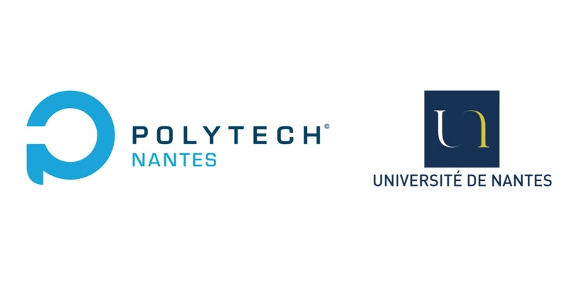

 
 

 

 

 

<h1>Projet de stage de fin d'études</h1>

 

Recherche et développement démonstrateur web:  le développement web full-stack d'un flux de travail boutique-logistique-entrepôt et de système IoT

 

 

 

 

 

 

 

 

Zijun PAN

 

Encadrement : Vincent Ricordel, Bruno Le Fellic

   

Mars - Août 2020

## Sommaire

[TOC]

 

## Abstract

Le thème de ce stage de fin d'études est sur le développement démonstrateur d'un flux de travail boutique-logistique-entrepôt. Mon travail comprend le développement de pages, la modification d'API et le déploiement de pages Web.

Dans la partie back, on utilise MongoDB, une base de données distribuée, universelle et basée sur des documents, pour stocker les données fictives générées par un script Python. L'API de ce projet est construite avec Python Flask et Swagger, qui nous permet de récupérer les données persistantes. 

Dans la partie front, on utilise Angular, le framework front-end de Google, pour construire un site web structuré et évolutif. Typescript(un sur-ensemble de Javascript), CSS et HTML sont à la base de la construction d'un composant Angular. Angular Material, une bibliothèque de components UI, est utilisée pour améliorer l'interface utilisateur.

Le logiciel Git est utilisé pour la synchronisation de projet avec le dépôt Git distant. Le front et le back sont connectés avec la structure JSON. Docker et docker-compose sont utilisés pour le déploiement de nos logiciels front et back à une machine Linux.

实习的第二个项目是将一个电信收费的分布式系统改造成为一个分布式的电动车的充电电桩的大数据管理方案。整体系统由一系列的微服务所组成，包括归一化文件、整合用户数据以及收集的数据、将整合的数据发布到Kafka分布式消息队列中以及在Vue框架构建的网页页面中获取相应的数据及进行对应的操作。

## 1. Introduction

这个报告解释了我本次在雷恩的SpikeeLabs中进行为期六个月的实习。SpikeeLabs是一家为客户提供信息服务系统的概念和实现的公司。我这次参与该企业的研发实习岗位，目的是实现服务系统的整个流程的功能和展示，包括API、Analytics和IHM。

### 1.1 À propos de SpikeeLabs

Spikeelabs est immatriculée en 2016. C’est une entreprise ESN basée à Rennes mais sert pour les client autour de la France. Depuis sa création, SpikeeLabs connaît une forte croissance tant en termes de chiffre d’affaires. Aujourd’hui le chiffre d’affaire est arrivé à 4 million euro et il y a plus de 50 salariés qui travaillent dans le bureau à Rennes, à Nantes et à Paris. 

(Source: https://www.spikeelabs.fr/ https://www.societe.com/societe/spikeelabs-823686027.html)

Comme une entreprise ESN typique, Spikeelabs fournit les services sur 4 activités:

- Conseil: Analyse les existences ainsi que les besoins. Donner la conception, Créer le cahier des charges pour le produit du client

- Réalisation: Développement du architecture et projet par rapport aux besoins du client. migration pour la base de données, amélioration et test de fonctionnements.

- Intégration: Appliquer le produit de Spikeelabs au projet existé

- Support: Maintenance, évaluation et adapation pour un projet du client.

### 1.2 Contexte

我的实习项目包括两个部分，两个项目的目的都是希望将企业原有的项目迁移到新的场景下去实现，让我们原来的功能能够在新的场景下实现功能的迭代、更新和拓展。第一个项目是基于企业的一个电信管理系统，我们希望将该系统迁移到仓库-物流-商铺场景下，构建一个仓库-物流-商铺的ETL管理系统。第二个项目是基于企业的分布式系统，我们希望把一个电信收费系统迁移到电动车充电桩的场景，通过分布式系统的信息收集我们将项目的收据收集起来并把数据进行一定的大数据分析。每个项目花费的时间各占了整个实习周期的一半。

### 1.3 Objectives

我的实习的目的是为企业在新项目迁移的过程中提供一些支持，进行一些项目的研究和开发。并在这个过程中熟悉企业中运用的不同技术和企业的日常运营。

## 2. Projet ETL

Voici un organigramme de notre projet de gestion logistique. Il s'agit notamment de magasin (CBR-Y2), de réseau logistique (ORLIWEB) et d'entrepôt (WES HABILLEMENT). 

Nous pouvons voir qu'il existe de nombreux workflows ci-dessus, ce sont les données qui seront générées dans le travail réel. Mais comme notre projet est un projet de recherche, nous utiliserons plutôt des données virtuelles.

C'est la première fois que j'entre dans une entreprise pour faire un stage, donc ce stage m'a donné l'opportunité de comprendre le flux de travail industriel et m'a permis d'apprendre à travailler professionnellement.

### 2.1 Génération des données fictives

Dans cette partie, nous avons terminé l'opération de génération de données de simulation. Nous avons spécifiquement utilisé Python comme langage pour générer des scripts et nous nous sommes connectés à la base de données Mongodb pour implémenter l'insertion de documents. De plus, nous utilisons également JSOn comme type de données pour réaliser une communication sans état entre les API.

Un exemple d'une commande générée dans MongoDB

### 2.2 Modifications des APIs Python

Le serveur principal de notre projet utilise le framework Flask et Swagger pour construire ce service. Notre ancien projet est un système typique de gestion de l'information logistique des télécommunications, donc notre travail consiste à modifier l'ancien projet pour l'adapter à notre nouveau type de données et système de type de service.

根据以上定义好的router，我们将可以构建好swagger.yml文件来对API的文档定义。然后我们使用swagger官方提供的swagger-codegen自动生成API类以及控制器。于是我们就能够网页上看到如下的API了。

Une exemple de Swagger UI pour visualiser l'API

### 2.3 Angular pour l'Interface Homme-Machine

Nous avons utilisé Angular comme framework frontal. Angular est un framework côté client open source de Google, basé sur TypeScript. 

Nous utilisons Angular pour faire beaucoup de conception fonctionnelle. Par exemple, nous pouvons ajouter une zone de recherche pour filtrer les résultats EAN, ou nous pouvons ajouter des informations supplémentaires sur le timeline.

Ici en ci-dessous nous présente les filtres qu'on a créés.

根据需求的不同，我们能够对命令的引用、小店的引用、条形码、命令的日期、命令的整合日期、文件命、命令的来源地、命令的目的地、命令所属的类别以及协议的版本号来进行过滤。

Les filtres pour filtrer les commandes

La page détail pour une commande particulière.

Le timeline est affiché dans la page détail

De plus, nous avons trié et trié certaines commandes erronées.

Une commande erronée

### 2.4 Déploiement en Docker

Après avoir terminé la conception front-end et back-end, notre projet peut s'exécuter normalement sur le serveur. Mais si nous voulons déployer le projet afin que le projet puisse toujours fournir des services et être plus facilement accessible, nous devons utiliser Docker.

Les services sont stockées dans des conteneurs docker

### 2.5 Test Unitaire

单元测试是检测项目能否正常工作以及TDD(test driven development)非常重要的一个思想.在我们这个项目中,我们对API进行了单元测试,因为我们后端使用的是Python语言,我们选用了Python中非常常用的一个编写单元测试的类库unittest库来帮助我们实现单元测试的流程.

## 3. Projet IoT

在我们的IoT项目中，我们将从uS Collecte这一步开始（我们使用的生成的数据代替），传入的不同格式的数据将被在normaliastion中整合成统一的格式存放在Cassandra中。接着我们将Cassandra中的归一化数据与存放在SQL Server中的用户数据做匹配，输出满足用户条件的数据给Kafka这个数据湖。
最后我们从kafka消息队列中取出数据，进行一定的大数据处理并显示在dashboard上。

### 3.1 Normalisation

normaliser les données

作为模拟数据，我们采用了“On-street Car Parking Sensor Data - 2017”这个墨尔本城在2017年对CBD区域的停车实地检测数据。它记录了传感器的ID、汽车到达时间、汽车离开时间、停留持续时间、路标、地理位置等数据。

### 3.2 Consolidation

mapper tous les données normalisées avec le serveur sql qui s'occupe des utilisateurs

### 3.3 Kafka

écouteur pour capturer les données

作为一个分布式的消息队列，kafka能够有效地帮助提高整个系统的稳健性。

为了实现对consolidation阶段的log的监听，我们在项目中引入了`KafkaHandler`来实现对consolidation的返回结果log的数据获取。为此我们在属于spikeelabs共享的`billing-labs-shared-utils`中的`applog.py`文件进行如下改写。

成果获取到的数据之后我们还能通过BigData进行一些分析，以下是BigData数据分析的一些实例。

### 3.4 Dashboard

afficher un API pour faciliter les opérations

### 3.5 Déploiement en Docker

Déployer le projet en docker

## 4. Conclusion

Grâce à ce projet, j'ai maîtrisé de nombreuses technologies et outils de développement front-end et back-end avec des scénarios d'application pratiques, tels que Git et Docker. Et ce projet de recherche a été fait par moi-même, et cela m'a aussi permis d'apprendre à gérer le projet et à être responsable de mon propre projet.