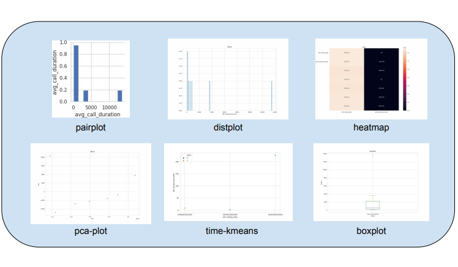

<br>
<br>

<br>

<br>

<br>

<br>

<br>

<br>

<center><div style="font-family: Georgia, serif; font-size:48px;">Projet de fin d'études</div</center>

<div style="border-top: 3px ridge #fff"></div>

<div style="margin:1em 3em;font-family: Verdana, Arial, Helvetica, sans-serif; font-size:1.2em;"><strong>R&D démonstrateur web</strong> : Conception et développement d’un démonstrateur web d'un flux de travail boutique-logistique-entrepôt et de système IoT</div>

<br>

<br>

<br>

<br>

<br>

<br>

<br>

<br>

<br>

<br>

<br>

<br>

<center><font size=3>Encadré par : Bruno Le Fellic, Vincent Ricordel</font></center>

<br>

<center><font size=3>Rédigé par : Zijun PAN</font></center>


<br>

<br><br>

<center>POLYTECH NANTES - ETN5</center>

<center>Mars - Août 2020</center>

<div style="page-break-after: always;"></div>

## Sommaire

<font size=4>

[TOC]

</font>

<br>

<div style="page-break-after: always;"></div>

## Abstract

La première phase de ce stage de fin d'études était consacrée au développement d'un démonstrateur d'un flux de travail boutique-logistique-entrepôt. Le travail comprend le développement de pages, la modification d'API et le déploiement de pages Web.

Dans la partie back, on utilise MongoDB, une base de données distribuée, universelle et basée sur des documents, pour stocker les données fictives générées par un script Python. L'API de ce projet est construite avec Python Flask et Swagger, qui nous permet de récupérer les données persistantes. 

Dans la partie front, on utilise Angular, le framework front-end de Google, pour construire un site web structuré et évolutif. Typescript(un sur-ensemble de Javascript), CSS et HTML sont à la base de la construction d'un composant Angular. Angular Material, une bibliothèque de components UI, est utilisée pour améliorer l'interface utilisateur.

Le deuxième projet du stage consiste à transformer un système de recharge de télécommunications distribué à une solution de gestion de big data distribuée pour les piles de recharge de véhicules électriques On intègre les données des utilisateurs et les données collectées, et publie les données intégrées sur Kafka.

Le logiciel Git est utilisé pour la synchronisation de projet avec le dépôt Git distant. Le front et le back se communiquent en JSON. Docker et docker-compose sont utilisés pour le déploiement des microservices sur une machine Linux.


<div style="page-break-after: always;"></div>
## Introduction

Ce rapport est une présentation de mon stage de six mois chez SpikeeLabs à Rennes. SpikeeLabs est une entreprise qui propose à ses clients les concepts et les réalisations des systèmes de service d'information. 

 J'ai travaillé sur la solution BillingLabs de l'entreprise, le but étant de réaliser la fonction et l'affichage de l'ensemble du processus du système de service, y compris API, Analytics et IHM.


### Contexte

Mon stage se compose de deux projets: le but des deux projets est de migrer le projet original de l'entreprise vers la nouvelle scène pour la réalisation, afin que notre fonction d'origine puisse être itérée, mise à jour et étendue dans la nouvelle scène. 

Le premier projet est un système de gestion des télécommunications basé sur l'entreprise. Nous espérons migrer le système vers le scénario entrepôt-logistique-magasin pour construire un système de gestion ETL entrepôt-logistique-magasin.

Le deuxième projet est basé sur le système d'architecture distribuée de l'entreprise. Nous espérons faire migrer un système de télécom billing vers le scénario de piles de recharge de véhicules électriques. Grâce à la collecte d'informations du système distribué, nous collectons la file d'attente des messages du projet et effectuons certaines analyses big data sur les données. 

Le temps consacré à chaque projet représente la moitié de l'ensemble du cycle de stage.


### Objectives

Le but de mon stage est de fournir un soutien aux entreprises dans le processus de migration de nouveaux projets, et de conduire la recherche et le développement de certains projets. Dans ce processus, je connais les différentes technologies utilisées dans l'entreprise et les opérations quotidiennes de l'entreprise.

<div style="page-break-after: always;"></div>

###  À propos de SpikeeLabs

Spikeelabs est immatriculée en 2016. C’est une entreprise ESN basée à Rennes mais sert pour les client autour de la France. Depuis sa création, SpikeeLabs connaît une forte croissance en termes de chiffre d’affaires. 


<center><div style="color:orange; border-bottom: 1px solid #d9d9d9;     display: inline-block;     color: #999;     padding: 2px;">Le logo de SpikeeLabs</div></center>


Comme une entreprise ESN typique, Spikeelabs fournit les services sur 4 activités:

- Conseil: Analyse les existences ainsi que les besoins. Donner la conception, Créer le cahier des charges pour le produit du client

- Réalisation: Développement du architecture et projet par rapport aux besoins du client. migration pour la base de données, amélioration et test de fonctionnements.

- Intégration: Appliquer le produit de Spikeelabs au projet existé

- Support: Maintenance, évaluation et adapation pour un projet du client.

  


<center><div style="color:orange; border-bottom: 1px solid #d9d9d9;     display: inline-block;     color: #999;     padding: 2px;">Les clients de SpikeeLabs</div></center>


Aujourd’hui le chiffre d’affaire est arrivé à 4 million euro et il y a plus de 50 salariés qui travaillent dans le bureau à Rennes, à Paris et à Nantes. 


<center><div style="color:orange; border-bottom: 1px solid #d9d9d9;     display: inline-block;     color: #999;     padding: 2px;">Cartes des 3 sites SpikeeLabs en France</div></center>

Plus d'informations peuvent être trouvées sur ce lien: https://www.spikeelabs.fr/ .

<div style="page-break-after: always;"></div>

## Technologies

### Développement

Dans nos projets, nous utilisons des technologies auxiliaires pour faciliter notre développement.

#### Angular

Afin de simplifier à la fois le développement et les tests de SPA (application d'une seule page), Angular peut nous fournir des architectures MVC (model-view-controller) et MVVM (model-view-viewmodel) côté client.

Le front-end de notre projet télécom original a été développé en utilisant Angular.


<center><div style="color:orange; border-bottom: 1px solid #d9d9d9;     display: inline-block;     color: #999;     padding: 2px;">Logo d'Angular</div></center>

Plus d'informations sur Angular peuvent être trouvées ici : https://angular.io/ .

#### Vue

Vue est un framework évolutif pour construire des interfaces utilisateur. Il s'agit d'un framework MVVM léger qui fournit une liaison de données efficace et un système de composants flexible via une API simple. 

Afin de réaliser un développement rapide, nous utilisons le framework Vue léger et simple pour développer le Dashboard du projet IoT.


<center><div style="color:orange; border-bottom: 1px solid #d9d9d9;     display: inline-block;     color: #999;     padding: 2px;">Logo de Vue.js</div></center>

Plus d'informations sur Angular peuvent être trouvées ici : https://vuejs.org/ .

#### Swagger

Swagger est une suite d'outils de développement d'API à la fois puissants et faciles à utiliser pour les équipes et les individus, permettant le développement sur l'ensemble du cycle de vie de l'API, de la conception et de la documentation aux tests et au déploiement.

Afin de faciliter la réalisation des fonctionalités de l'API, nous utilisons le Swagger Codegen pour la génération de code et Swagger UI pour la visualisation.


<center><div style="color:orange; border-bottom: 1px solid #d9d9d9;     display: inline-block;     color: #999;     padding: 2px;">Logo de Swagger</div></center>

Plus d'informations sur Swagger peuvent être trouvées ici : https://swagger.io/ .

<div style="page-break-after: always;"></div>

#### Flask

Flask est un framework d'application web WSGI (Web Server Gateway Interface) léger. Il est conçu pour rendre la mise en route rapide et facile, avec la possibilité de s'adapter à des applications complexes.

Afin de réaliser un hébergement de services Web back-end, nous utilisons Flask pour nous aider à créer le serveur.

Plus d'informations sur Flask peuvent être trouvées ici : https://palletsprojects.com/p/flask/ .

#### MongoDB

Afin de rendre l'intégration des données plus facile et plus rapide, nous utilisons MongoDB comme base de données pour développer des documents de type JSON avec des schémas dynamiques.


<center><div style="color:orange; border-bottom: 1px solid #d9d9d9;     display: inline-block;     color: #999;     padding: 2px;">Logo de MongoDB</div></center>

Plus d'informations sur MongoDB peuvent être trouvées ici : https://www.mongodb.com/ .

#### SQL Server

SQL Server est un système de gestion de base de données (SGBD) en langage SQL incorporant entre autres un SGBDR (SGBD relationnel) développé et commercialisé par la société Microsoft.

Nous utilisons une base de données SQL Server pour stocker les informations relatives au compte.


<center><div style="color:orange; border-bottom: 1px solid #d9d9d9;     display: inline-block;     color: #999;     padding: 2px;">Logo de SQL Server</div></center>

Plus d'informations sur SQL Server : https://www.microsoft.com/sql-server

#### Cassandra

Cassandra est un SGBD de type NoSQL conçu pour gérer des quantités massives de données sur un grand nombre de serveurs. C'est une solution de stockage de données structurée distribuée populaire.

Dans notre projet IoT, nous l'utilisons pour stocker les données EDR (Event Detail Record).


<center><div style="color:orange; border-bottom: 1px solid #d9d9d9;     display: inline-block;     color: #999;     padding: 2px;">Logo de Cassandra</div></center>

Plus d'informations sur Cassandra peuvent être trouvées ici : https://cassandra.apache.org/

<div style="page-break-after: always;"></div>

#### RabbitMQ

RabbitMQ est un logiciel d'agent de messages open source qui implémente le protocole Advanced Message Queuing (AMQP). Afin de permettre au projet de faire face à un volume plus élevé de demandes, nous avons utilisé RabbitMQ pour traiter les messages de demande.


<center><div style="color:orange; border-bottom: 1px solid #d9d9d9;     display: inline-block;     color: #999;     padding: 2px;">Logo de RabbitMQ</div></center>

Plus d'informations sur RabbitMQ peuvent être trouvées ici : https://www.rabbitmq.com/

#### Kafka

Kafka peut fournir un mécanisme de file d'attente de messages pour améliorer la fiabilité des données de log. 

Pour transmettre les données de log au réseau distribué Kafka afin de garantir la fiabilité, nous utilisons lensio/fast-data-dev, une configuration Kafka à part entière.


<center><div style="color:orange; border-bottom: 1px solid #d9d9d9;     display: inline-block;     color: #999;     padding: 2px;">Logo de Kafka</div></center>

Plus d'informations sur Kafka :https://kafka.apache.org/

#### Docker

Docker is a tool designed to make it easier to create, deploy, and run applications by using containers. Containers allow a developer to package up an application with all of the parts it needs

Afin d'implémenter le déploiement de microservices pour ces deux projets, nous avons utilisé Docker dans le serveur pour déployer les microservices dans le conteneur Docker.


<center><div style="color:orange; border-bottom: 1px solid #d9d9d9;     display: inline-block;     color: #999;     padding: 2px;">Logo de Docker</div></center>

Plus d'informations sur Docker peuvent être trouvées ici : https://www.docker.com/

<div style="page-break-after: always;"></div>

### Outils de coopération

Bien que le projet de stage soit un projet personnel, , j’ai utilisé également de nombreux outils de projets collaboratifs dans l'entreprise, tels que GitLab, Teams, Trello et One Drive.

#### GitLab

GitLab est un service d'hébergement de référentiel Git basé sur le Web. Il offre toutes les fonctionnalités de contrôle des révisions distribuées et de gestion du code source (SCM) de Git ainsi que l'ajout de ses propres fonctionnalités. Contrairement à Git, qui est strictement un outil de ligne de commande, GitLab fournit une interface graphique Web. 

Il fournit également un contrôle d'accès et plusieurs fonctionnalités de collaboration comme le suivi des bogues, les demandes de fonctionnalités, la gestion des tâches et les wikis pour chaque projet.


<center><div style="color:orange; border-bottom: 1px solid #d9d9d9;     display: inline-block;     color: #999;     padding: 2px;">Les projets ETL dans le Git de SpikeeLabs</div></center>

GitLab intègre  également des fonctions telles que CI (Continuous  Integration).

#### Teams

Microsoft Teams est une application de collaboration qui permet à l'équipe de rester organisée et d’avoir des conversations au même endroit.

- Équipes: rechercher des canaux pour en faire partie ou réserver notre propre canal. Dans les canaux, nous pouvons organiser une réunion immédiate, discuter et partager des fichiers.

- Réunions: afficher toutes les réunions prévues de la journée ou de la semaine. Ou bien, planifier une réunion. Ce calendrier se synchronise avec le calendrier Outlook.

- Appels: dans certains cas, si l'organisation a installé cette fonctionnalité, nous pouvons appeler qui nous voulons à partir de Teams, même si ces personnes ne l'utilisent pas.

- Activité: consulter tous les messages non lus, @mentions, réponses, etc.

#### Trello

Trello est un outil de gestion de projet gratuit en ligne. Inspiré par la méthode Kanban de Toyota, Trello repose sur une organisation des projets en planches listant des cartes, chacune représentant des tâches. Les cartes sont assignables à des utilisateurs et sont mobiles d'une planche à l'autre, traduisant leur avancement.

Trello permet ainsi de travailler sur des projets collaboratifs depuis n'importe où dans le monde, tout en étant notifié sur les différents apports réalisés par les membres. 

#### One Drive

OneDrive est un service d'hébergement de fichiers qui permet aux utilisateurs de synchroniser des fichiers et d'y accéder ultérieurement à partir d'un navigateur Web ou d'un appareil mobile. Les utilisateurs peuvent partager des fichiers publiquement ou avec leurs contacts.

#### Gantt


<div style="page-break-after: always;"></div>

## Projet ETL

### Organisation

ETL, l'abréviation de Extract-Transform-Load en anglais, est utilisé pour décrire le processus d'extraction, de transformation et de chargement de données de la source à la destination. Le terme ETL est plus couramment utilisé dans le stockage de données, mais son objet ne se limite pas au stockage de données.


<center><div style="color:orange; border-bottom: 1px solid #d9d9d9;     display: inline-block;     color: #999;     padding: 2px;">Les principes de modèle ETL</div></center>

Dans notre projet, nous utilisons le modèle ETL pour nous aider à développer et intégrer front-end et back-end.


<center><div style="color:orange; border-bottom: 1px solid #d9d9d9;     display: inline-block;     color: #999;     padding: 2px;">Le modèle ETL adapté</div></center>

<div style="page-break-after: always;"></div>

Nous divisons le projet ETL en les parties suivantes pour organiser l'exécution des tâches, afin de faciliter la compréhension et la gestion de l'ensemble de notre projet.


<center><div style="color:orange; border-bottom: 1px solid #d9d9d9;     display: inline-block;     color: #999;     padding: 2px;">Les tâches détaillées de projet ETL</div></center>

Le développement de chaque étape est divisé en deux étapes : l'apprentissage et le codage.

<div style="page-break-after: always;"></div>

### Génération des données fictives

Voici un organigramme de notre projet de gestion logistique. Il s'agit notamment de magasin (CBR-Y2), de réseau logistique (ORLIWEB) et d'entrepôt (WES HABILLEMENT). 


<center><div style="color:orange; border-bottom: 1px solid #d9d9d9;     display: inline-block;     color: #999;     padding: 2px;">L'organigramme du projet ETL</div></center>


Nous pouvons voir qu'il existe de nombreux workflows ci-dessus, ce sont les données qui seront générées dans le travail réel. Mais comme notre projet est un projet de recherche, nous utiliserons plutôt des données virtuelles.

Selon cet organigramme, nous pouvons obtenir la relation entre différents flux de transmission. Nous résumons l'organigramme et obtenons le flux de commandes suivant.


<center><div style="color:orange; border-bottom: 1px solid #d9d9d9;     display: inline-block;     color: #999;     padding: 2px;">Les flux dans le système ETL</div></center>

Nous pouvons diviser ces flux en quatre catégories, à savoir `Catalog`, `Commande`, `Returns` et `Synchro`.


<center><div style="color:orange; border-bottom: 1px solid #d9d9d9;     display: inline-block;     color: #999;     padding: 2px;">Les quatre catégories de flux </div></center>

Dans cette partie, nous avons terminé l'opération de génération de données de simulation. Nous avons spécifiquement utilisé Python comme langage pour générer des scripts et nous nous sommes connectés à la base de données MongoDB pour implémenter l'insertion de documents. Nous utilisons également JSON comme type de données pour réaliser une communication sans état entre les API.


<center><div style="color:orange; border-bottom: 1px solid #d9d9d9;     display: inline-block;     color: #999;     padding: 2px;">Un exemple d'une commande générée dans MongoDB</div></center>

<div style="page-break-after: always;"></div>
### Modifications des APIs Python

Le serveur principal de notre projet utilise le framework Flask et Swagger pour construire ce service. Notre ancien projet est un système typique de gestion de l'information logistique des télécommunications, donc notre travail consiste à modifier l'ancien projet pour l'adapter à notre nouveau type de données et système de type de service.


<center><div style="color:orange; border-bottom: 1px solid #d9d9d9;     display: inline-block;     color: #999;     padding: 2px;">L'API du système d'origine</div></center>

Nous avons défini un nouveau type de données pour notre projet et défini une nouvelle API basée sur l'API d'origine. Il comprend les opérations suivantes.


<center><div style="color:orange; border-bottom: 1px solid #d9d9d9;     display: inline-block;     color: #999;     padding: 2px;">La conception d'API pour ETL</div></center>

Sur la base du routeur défini ci-dessus, nous pourrons construire le fichier `swagger.yml` pour définir la documentation de l'API. Ensuite, nous utilisons swagger-codegen officiellement fourni par swagger pour générer automatiquement des classes d'API et des contrôleurs. Nous pouvons donc voir l'API suivante sur la page Web.


<center><div style="color:orange; border-bottom: 1px solid #d9d9d9;     display: inline-block;     color: #999;     padding: 2px;">Swagger UI pour visualiser l'API</div></center>

<div style="page-break-after: always;"></div>
### Angular pour l'Interface Homme-Machine

Angular est un framework côté client open source de Google, basé sur TypeScript. Nous avons également utilisé son interface utilisateur, Angular Material, pour développer une page front texturée. 

Angular est utilisé pour faire beaucoup de conception fonctionnelle. Par exemple, nous pouvons ajouter une zone de recherche pour filtrer les résultats EAN, ou nous pouvons ajouter des informations supplémentaires sur le timeline.

On présente ci-dessous les filtres qu'on a créé. Selon les différents besoins, on peut filtrer la référence de la commande, la référence de la boutique, le code barre EAN, la date de la commande, la date d'intégration de la commande, le nom du fichier, la source de la commande, la destination de la commande, la catégorie de la commande et la version de protocole.


<center><div style="color:orange; border-bottom: 1px solid #d9d9d9;     display: inline-block;     color: #999;     padding: 2px;">Les filtres pour filtrer les commandes</div></center>

Le test d'une page peut être effectué. On précise que la référence de la commande commence par "IAS" et la commande passe de "boutique" à "ERP" (insensible à la casse). La date de la commande est fixée au 13/03/2019.


<center><div style="color:orange; border-bottom: 1px solid #d9d9d9;     display: inline-block;     color: #999;     padding: 2px;">Les commandes filtrées</div></center>

De plus, lorsque nous cliquons sur une page, celle-ci doit pouvoir afficher les informations détaillées de la commande et toutes les commandes qui y sont liées dans le même workflow.  Ces commandes forment le timeline.


<center><div style="color:orange; border-bottom: 1px solid #d9d9d9;     display: inline-block;     color: #999;     padding: 2px;">Le timeline est affiché dans la page détail</div></center>


Lors de la génération de données, nous avons également généré certains types de données qui indiquent des erreurs pour identifier les problèmes pouvant survenir pendant le processus de commande, tels que des erreurs d'inventaire, des erreurs de transaction ou des erreurs de format.


<center><div style="color:orange; border-bottom: 1px solid #d9d9d9;     display: inline-block;     color: #999;     padding: 2px;">Une commande erronée</div></center>


<div style="page-break-after: always;"></div>

### Test Unitaire

Les tests unitaires sont utilisés pour détecter si le projet peut fonctionner normalement. C'est une pratique très importante pour le développement TDD (développement piloté par les tests). 

Dans notre projet, nous testons l'API et le front-end. Parce que notre backend utilise le langage Python, nous avons choisi la bibliothèque unittest, une bibliothèque très couramment utilisée pour écrire des tests unitaires en Python, pour nous aider à implémenter le processus de test unitaire.

```python
    # test count_files without param
    def test_count_files_none(self)
    
    # test count_files with param
    def test_count_files_param(self)

    # test search_files without param
    def test_search_files_none(self)

    # test search_files with param
    def test_search_files_param(self)
    
    # test count_orders without param
    def test_count_orders_none(self)

    # test count_orders with param
    def test_count_orders_param(self)

    # test search_orders without param
    def test_search_orders_none(self)

    # test search_orders with param
    def test_search_orders_param(self)
```

<center><div style="color:orange; border-bottom: 1px solid #d9d9d9;     display: inline-block;     color: #999;     padding: 2px;">Les fonctions de test </div></center>

Ce qui suit est le résultat de notre test unitaire, ce qui signifie que notre projet a réussi le test unitaire.


<center><div style="color:orange; border-bottom: 1px solid #d9d9d9;     display: inline-block;     color: #999;     padding: 2px;">L'affichage dans le console des tests unitaires </div></center>


<div style="page-break-after: always;"></div>
### Déploiement en Docker

Après avoir terminé la conception front-end et back-end, notre projet peut s'exécuter normalement en local de VM. 


<center><div style="color:orange; border-bottom: 1px solid #d9d9d9;     display: inline-block;     color: #999;     padding: 2px;">Les services sont stockées dans des conteneurs docker</div></center>

Mais si nous voulons déployer le projet afin que le projet puisse toujours fournir des services et être plus facilement accessible, nous devons utiliser Docker.


<div style="page-break-after: always;"></div>

## Projet IoT

### Organisation

Dans notre projet IoT, nous commencerons par l'étape uS Collecte (nous utilisons les données générées à la place) .

Les données entrantes dans différents formats seront intégrées en normaliastion dans un format unifié et stockées dans Cassandra. 


<center><div style="color:orange; border-bottom: 1px solid #d9d9d9;     display: inline-block;     color: #999;     padding: 2px;">Le processus global du projet</div></center>

Ensuite, nous faisons correspondre les données normalisées dans Cassandra avec les données utilisateur stockées dans SQL Server, et sortons les données qui répondent aux conditions utilisateur dans le lac de données de Kafka.

Enfin, nous sortons les données de la file d'attente de messages Kafka, effectuons certains traitements de Big Data et les affichons sur le dashboard.

<div style="page-break-after: always;"></div>


<center><div style="color:orange; border-bottom: 1px solid #d9d9d9;     display: inline-block;     color: #999;     padding: 2px;">Les tâches détaillées de projet IOT</div></center>

Tout comme ce que nous avons fait dans le projet ETL, nous pouvons diviser le projet IoT en quelques petites tâches.


<div style="page-break-after: always;"></div>

### Normalisation

À l'étape Normalisation, ce que nous devons faire est de traiter les données brutes collectées, afin que nous puissions obtenir les données de trois formats de fichiers différents (JSON, CSV et XML) à un format unifié. 


<center><div style="color:orange; border-bottom: 1px solid #d9d9d9;     display: inline-block;     color: #999;     padding: 2px;">Le principe du microservice normalisation</div></center>

Les données normalisées seront transférées à l'étape suivante, la consolidation.

Voici comment la même donnée est représentée dans trois formats différents.

```csv
DeviceId,ArrivalTime,DepartureTime
"18,773",04/11/2017 07:24:35 AM,04/11/2017 07:30:00 AM
```

```json
{
		"DeviceId": "18,773",
		"ArrivalTime": "04/11/2017 07:24:35 AM",
		"DepartureTime": "04/11/2017 07:30:00 AM",
}
```

```xml
<row>
	<deviceid>18773</deviceid>
	<arrivaltime>2017-04-11T07:24:35</arrivaltime>
	<departuretime>2017-04-11T07:30:00</departuretime>
</row>
```

<center><div style="color:orange; border-bottom: 1px solid #d9d9d9;     display: inline-block;     color: #999;     padding: 2px;">Une exemple des trois formats de données : CSV, JSON, XML</div></center>

Comme données de simulation, nous avons utilisé _On-street Car Parking Sensor Data-2017_, les données de détection des places de stationnement de la ville de Melbourne dans la zone CBD en 2017. 

Il enregistre l'ID du capteur, l'heure d'arrivée de la voiture, l'heure de départ de la voiture, la durée du séjour, les panneaux de signalisation, l'emplacement géographique et d'autres données.


<center><div style="color:orange; border-bottom: 1px solid #d9d9d9;     display: inline-block;     color: #999;     padding: 2px;">Les données normalisées sont stockées dans Cassandra</div></center>

Les données normalisées stockées dans la base de données Cassandra après normalisation sont présentées ci-dessus.

<div style="page-break-after: always;"></div>

### Consolidation

Cette étape consiste à mapper toutes les données normalisées avec les données relatives à l'utilisateur dans SQL Server.

Selon la relation entre RabbitMQ, SQL Server et Cassandra et la relation entre les données utilisateur et les données normalisées, nous avons la conception suivante.


<center><div style="color:orange; border-bottom: 1px solid #d9d9d9;     display: inline-block;     color: #999;     padding: 2px;">Le principe du microservice condolidation</div></center>

On obtient le nom de fichier qui doit être normalisé en surveillant RabbitMQ. À ce stade, la normalisation traitera le fichier et stockera les données normalisées dans Cassandra.

Ensuite, on envoie une demande à SQL Server pour obtenir des données d'accès utilisateur dans SQL Server. On envoie également une demande à Cassandra pour obtenir les données normalisées.

Le microservice consolidation peut faire correspondre les données d'accès de l'utilisateur avec les données normalisées et stocker les données qui répondent aux exigences de consolidation dans Cassandra.

Afin de simuler le processus ci-dessus, on génère des données fictives pour utilisateur et les services. Cela est lié aux cinq tables de SQL Server, elles sont `dbo.account`, `dbo.calling_access`, `dbo.invoice`, `dbo.billed_invoice_status` et `dbo.subscription`.


<center><div style="color:orange; border-bottom: 1px solid #d9d9d9;     display: inline-block;     color: #999;     padding: 2px;">Le console indiquant les cinq tables générées</div></center>

La figure suivante montre que les données générées ont été correctement stockées dans SQL Server.


<center><div style="color:orange; border-bottom: 1px solid #d9d9d9;     display: inline-block;     color: #999;     padding: 2px;">Les données de table dbo.account dans SQL Server</div></center>

On compare la référence des données en noramlisation avec la référence des données générées dans SQL Server pour confirmer si les deux données correspondent. 

Si elles correspondent, les données sont intégrées dans un nouveau type de données `edr_consolidated` et enregistrées dans Cassandra.


<center><div style="color:orange; border-bottom: 1px solid #d9d9d9;     display: inline-block;     color: #999;     padding: 2px;">Les données consolidées sont stockées dans Cassandra</div></center>

On peut voir dans la figure ci-dessus que nos données consolidées ont été affichées avec succès dans Cassandra.

<div style="page-break-after: always;"></div>

### Kafka

En tant que niveau de message distribué, kafka peut effectivement aider à améliorer la robustesse de la propagation des messages du système.


Afin de surveiller le log dans la phase de consolidation, nous avons introduit `KafkaHandler` dans le projet pour obtenir les données de la sortie du log par la consolidation. Pour ce faire, nous réécrivons le fichier `applog.py` dans` billing-labs-shared-utils` partagé par spikeelabs comme suit. 

```python 
def configure(component_name, component_instance_id=None, is_threaded=False, requestid_formatter=None):
    # ... code ... #
	mylogger = logging.getLogger()
	kh = KafkaHandler()  
	formatter = CustomJsonFormatter('(@timestamp) (levelname) (component_name) (inst_id) (name) (message)')
	kh.setFormatter(formatter)
	mylogger.addHandler(kh)
    # ... code ... #
```

Afin de surveiller le log de la phase de consolidation, nous avons introduit `KafkaHandler` dans le projet pour obtenir des données à partir de la sortie de la consolidation.

Grâce à fast-data-dev, nous pouvons facilement obtenir une interface utilisateur sur `http://localhost:3030`. Les données obtenues en modifiant le `applog.py` et en surveillant le log peuvent être affichées comme suit. 


Ces données peuvent être enregistrées dans plusieurs sauvegardes dans Kafka pour assurer la redondance des données.

<div style="page-break-after: always;"></div>

### Dashboard

Un autre stagiaire Big Data et moi avons construit cette partie de démonstrateur de données.

Afin de réaliser un développement rapide et d'obtenir un bon effet d'affichage, on utilise le framework Vue pour réaliser le développement et utilise Element UI pour améloirer l'affichage. Les pages développées avec Element UI peuvent s'adapter à l'esthétique moderne, et il existe de nombreux composants pour Element UI.

Selon nos exigences en matière d'API back-end, on doit fournir des interfaces côté Web pour les trois processus BigData / MachinLearning. On a donc conçu le routage suivant.


<center><div style="color:orange; border-bottom: 1px solid #d9d9d9;     display: inline-block;     color: #999;     padding: 2px;">La conception de routeur en Vue</div></center>

Afin de réaliser la communication entre la page front-end et la file d'attente de messages de Kafka, nous utilisons Axios pour partage des ressources entre origines multiples.

```javascript
axios(config).then((response) => {
    this.msg = response.data['Message'] + ' with status code ' + response.data['Status Code'];
    console.log(JSON.stringify(response.data));
}).catch((error)=>{
    this.msg = error;
    console.log(error);
});
```

Cela nous permet de faire des demandes de ressources interdomaines et de renvoyer un objet Promise en JavaScript pour indiquer que la ressource que nous avons demandée sera renvoyée de manière asynchrone.

<div style="page-break-after: always;"></div>

Après avoir obtenu les données de Kafka, nous pouvons tester sur la page front.


<center><div style="color:orange; border-bottom: 1px solid #d9d9d9;     display: inline-block;     color: #999;     padding: 2px;">L'IHM pour faire des demandes Big Data vers serveur avec pop-up message</div></center>


<center><div style="color:orange; border-bottom: 1px solid #d9d9d9;     display: inline-block;     color: #999;     padding: 2px;">L'interface pour le Fraud Detection</div></center>

<div style="page-break-after: always;"></div>

Nous pouvons faire des demandes de big data sur la page et obtenir des analyses statistiques, telles que distplot, heatmap, etc.



<center><div style="color:orange; border-bottom: 1px solid #d9d9d9;     display: inline-block;     color: #999;     padding: 2px;">Les analytics Big Data avec nos données venant de Kafka</div></center>


<div style="page-break-after: always;"></div>


## Conclusion

Grâce à ce projet, j'ai maîtrisé de nombreuses technologies et outils de développement front-end et back-end avec des scénarios d'application pratiques, tels que Git et Docker. Et ce projet de recherche a été fait par moi-même, et cela m'a aussi permis d'apprendre à gérer le projet et à être responsable de mon propre projet.


Tous ces éléments ont apporté un soutien conceptuel plus riche à la gestion de mon projet de fin d'études mené en 5ème année d’Électronique et Technologies Numériques.

<div style="page-break-after: always;"></div>

## Références

- Fernando Monteiro – Learning Single-page Web Application Development
- Angular docs : https://angular.io/docs
- Le Guide Angular par Marmicode : https://guide-angular.wishtack.io/
- MongoDB documentation : https://docs.mongodb.com/manual/
- lensesio/fast-data-dev : https://github.com/lensesio/fast-data-dev
- lensesio/kafka-cheat-sheet : https://github.com/lensesio/kafka-cheat-sheet
- Docker docs : https://docs.docker.com/get-docker/
- On-street Car Parking Sensor Data - 2017 : https://data.melbourne.vic.gov.au/Transport/On-street-Car-Parking-Sensor-Data-2017/u9sa-j86i
- Cross-origin resource sharing (CORS) : https://developer.mozilla.org/fr/docs/Web/HTTP/CORS